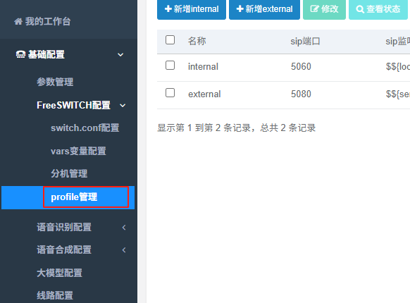
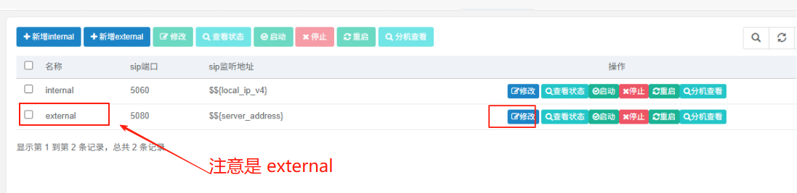
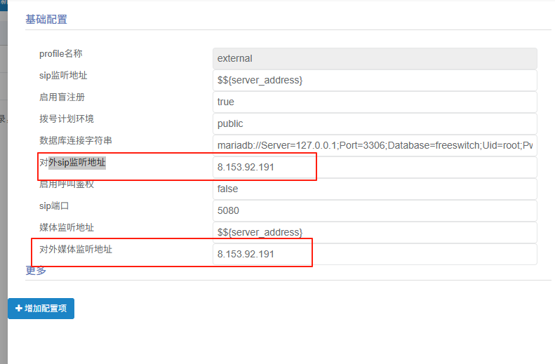
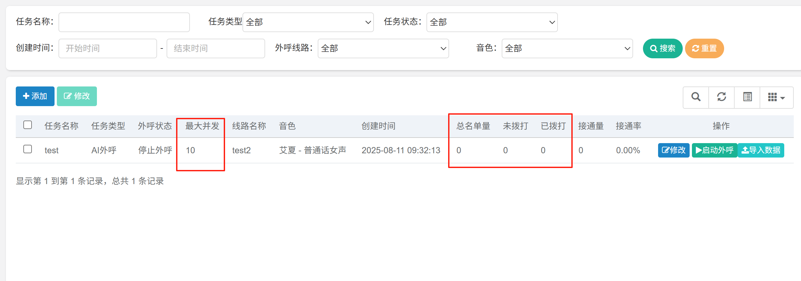
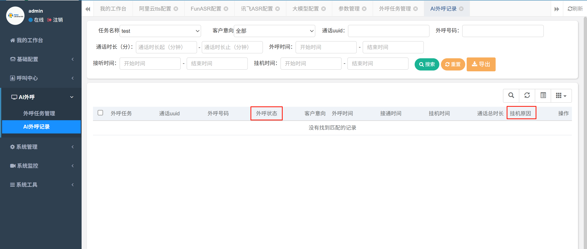
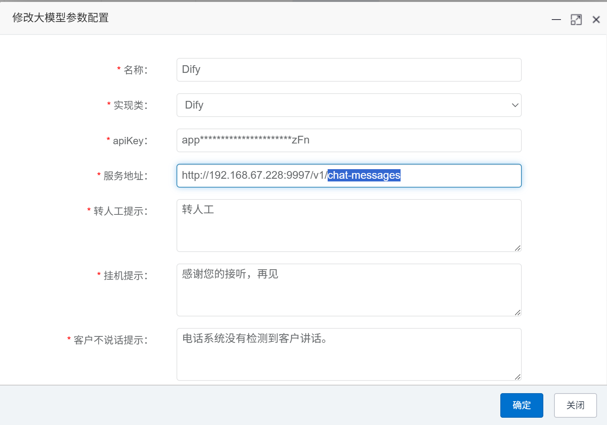
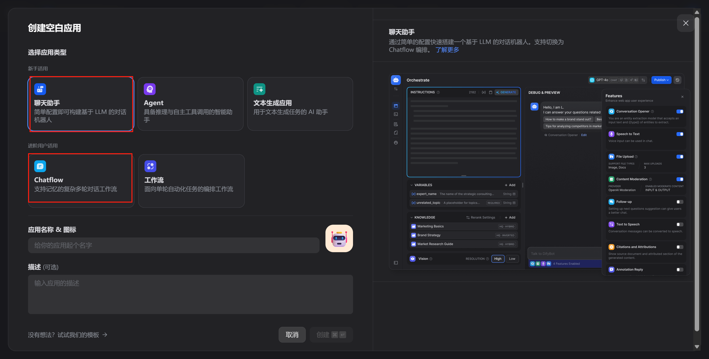
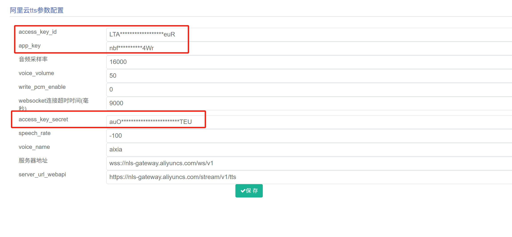
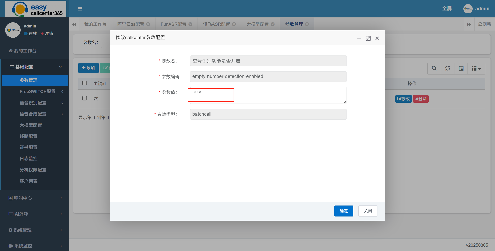

## easycallcenter365常见问题及解决办法

### 通话30多秒后自动挂机
如果使用的公有云服务器，注意以下2点。
1. 修改 external 的 "对外sip监听地址"、"对外媒体监听地址"为公网地址。
   然后重启FreeSWITCH： docker restart freeswitch-debian12
   

   

   

2.  软电话注册使用5080端口拨测，而如果你使用的是5060端口，大概30多秒后会自动挂机。
    比如： 210.xx.xx.81:5080

3. 防火墙添加端口映射。 udp协议: 5080端口，udp端口范围：21002到31002。

### 启动外呼任务，没接到电话
排查方法：进入“AI外呼->外呼任务管理”和“AI外呼->AI外呼记录”两个页面，关注外呼任务列表的“任务类型”、“最大并发”、“总名单量”和“未拨打”列的值，和外呼记录列表的“外呼状态”列的值。

情况1：“任务类型”不是“AI外呼”
分析：关于3种任务类型的描述如下，每个任务类型使用对应的名单导入模板
（1） 纯人工预测外呼，是系统自动批呼，接通后转真人坐席，真人与客户沟通，坐席等待接通电话即可，不需要手动拨号，省去了等待振铃的时间，可以提升外呼效率，必须有空闲坐席电话才会呼出去
（2）AI外呼，是系统自动批呼，接通后由设置的大模型底座与客户进行沟通
（3）语音通知，是系统自动批呼，接通后播放一句话通知，没有多轮交互，请使用语音通知的导入模板，在导入时填写通知内容，必须有通知内容电话才能呼出去

情况2：“最大并发”大于1，但是实际线路只有1个并发（比如只有一个插卡设备）
分析：最大并发n代表同时外呼n个电话出去，如果线路只有1个并发，多余的外呼都是未接通

情况3：导入的excel文件有20行，“总名单量”只显示15
分析：名单导入时，会对同一个文件的号码进行去重，另外注意，支持对任务追加名单，同一个任务不同文件的名单不去重，追加的名单量累加到总名单量上（比如第一次导入10个名单，第二次导入15个，那总名单量就是25）

情况4：“未拨打”一直显示大于0
分析：导入名单后，需要手动点击“启动任务”

情况5：“未拨打”为0，点击“启动任务”后未拨打
分析：需要手动导入名单以后，再启动任务，已经外呼过的名单点击启动任务是不会重复外呼的

情况6：外呼记录列表的“外呼状态”显示“线路异常”
分析：电话打出去了，但是没打通，可能是线路欠费了，网络不通，设备不稳定，设备停机，线路封停等原因，注意：只要外呼记录列表有记录，就说明电话打出去了，就不是外呼系统的问题，请从网络、线路、网关设备上排查

### 电话接通后秒挂
排查方法：
(1) 查看easycallcenter365的日志，日志路径:/home/easycallcenter365/logs/easycallcenter365.log
(2) 如果日志没有报错，检查线路配置（基础配置->线路配置）、大模型配置（基础配置->大模型配置），如果是coze、dify或者maxkb，务必先通过文本测试后再接入

注意1：dify的url地址后面要加“/chat-messages”，比如“http://192.168.67.228:9997/v1/chat-messages”

注意2：如果是dify，应用类型请选择“聊天助手”或者“ChatFlow”，不要选择“Agent”

### 电话接通后没有声音
排查方法：排查语音合成配置（基础配置->语音合成配置），检查设置的access key id、app key、access key secret是否正确，如果不确定可以重新设置一次试一下

### 电话接通后听不到客户说的话
排查方法：
（1）如果服务器在防火墙后， 防火墙添加端口映射。 udp协议: 5080端口，udp端口范围：21002到31002。
（2）检查语音识别配置（基础配置->语音识别配置），检查设置的access key id、app key、access key secret是否正确

### 如何设置分机相互拨打

默认没有开启分机相互拨打的路由，因为分机的调度是通过呼叫中心内部实现的。
正常情况不需要设置，否则会影响呼叫中心的调度。

如果需要设置分机相互拨打，请参考一下步骤。

* 进入目录: cd `/home/freeswitch/etc/freeswitch/dialplan`
* 删除文件: rm -rf default.xml 
* 下载文件[default.xml](https://gitee.com/easycallcenter365/freeswitch-modules-libs/blob/master/FreeSWITCH-Config-Files/conf/dialplan/default.xml) ， 并上传到 `/home/freeswitch/etc/freeswitch/dialplan` 目录下。
* 刷新`FreeSWITCH`配置： docker exec -it freeswitch-debian12 /usr/local/freeswitchvideo/bin/fs_cli -x reloadxml
* 软电话注册到 5060 端口。接下来就可以进行分机互打测试了。

### 如何升级到最新版v20250817

1.  下载二进制文件。 下载地址: 
https://pan.baidu.com/s/1xFgMPCu0VKHKnG69QhyTlA 提取码: etv5 

2. 用网盘最新的 easycallcenter365.jar、easycallcenter365-gui.jar 替换掉
服务器上 /home/easycallcenter365/ 下面的文件。

3.  下载网盘中的 upgrade/to_v20250817/upgrade.sql
   然后打开数据库执行即可。
   
4. 重启程序 cd /home/easycallcenter365/ && sh stop.sh  && sh start.sh
     

